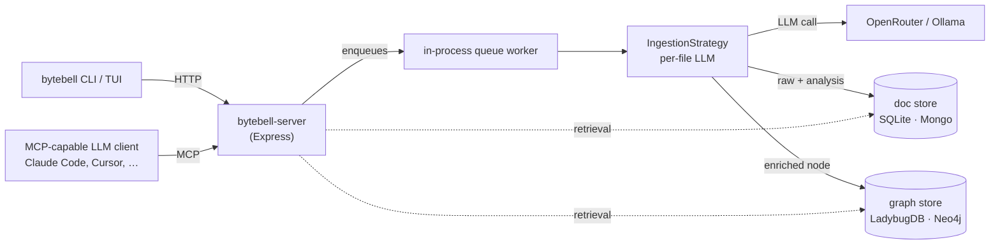
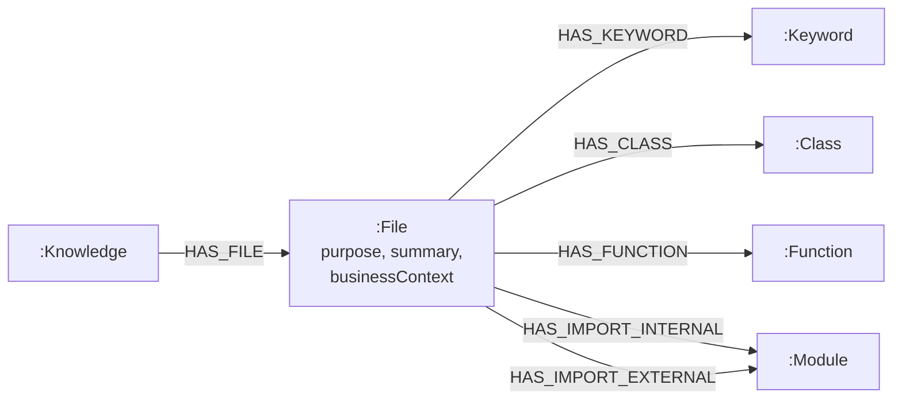
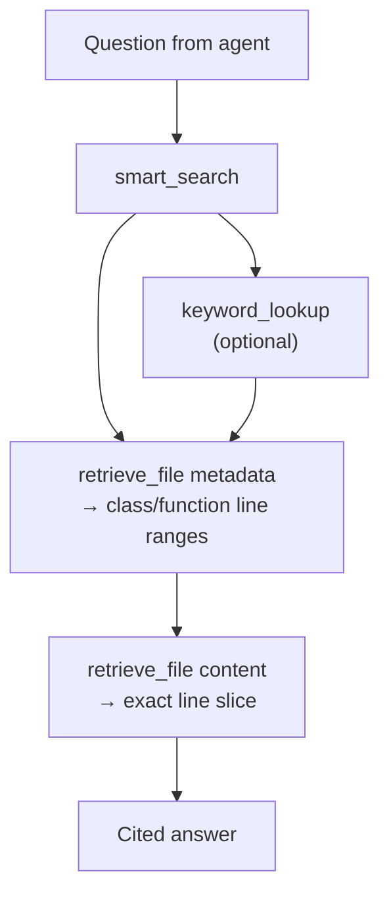

<div align="center">

<!-- Hero banner — drop your image at docs/assets/bytebell-banner.png, then uncomment:
        to be made
-->

# Open-IR

### A code knowledge graph for your AI coding agent

**Local-first** &nbsp;·&nbsp; **Embedded by Default** &nbsp;·&nbsp; **No Telemetry**

[**Get Started**](docs/getting-started.md) &nbsp;·&nbsp; [Commands](docs/commands.md) &nbsp;·&nbsp; [Configuration](docs/configuration.md) &nbsp;·&nbsp; [Architecture](docs/arch.md) &nbsp;·&nbsp; [Comparison](comparison.md) &nbsp;·&nbsp; [bytebell.ai](https://bytebell.ai)

[](LICENSE)
&nbsp;[](https://bun.sh)
&nbsp;[](tsconfig.base.json)
&nbsp;[](docs/getting-started.md)

</div>

---

> Your AI agent can't read your whole codebase, so it guesses. **Open-IR builds it a queryable map.** Point `bytebell` at a repo and it builds an LLM-enriched knowledge graph — every file's purpose, summary, business context, classes, and imports — then serves it over **MCP** to Claude Code, Cursor, and any MCP client. Everything runs on your machine; nothing leaves it except the calls to the model you choose.

## Run it in 5 minutes

> Open-IR's default **embedded** mode keeps everything in local files under `~/.bytebell` (SQLite + LadybugDB + Honker). The full walkthrough — Docker mode, bring-your-own-infra, troubleshooting — is in **[docs/getting-started.md](docs/getting-started.md)**.

**You need:** [Bun](https://bun.sh) ≥ 1.1, git, and an [OpenRouter](https://openrouter.ai) API key _or_ a local [Ollama](https://ollama.com) model.

```bash
# 1 · install — clones the repo, installs deps, links the `bytebell` command
curl -fsSL https://raw.githubusercontent.com/ByteBell/open-ir/main/install.sh | bash

# 2 · one interactive wizard: LLM provider → infra (Embedded, no Docker) → optional repo.
#     Then it boots, indexes, and auto-wires the MCP endpoint into your editor.
bytebell setup

# 3 · restart your editor, then ask it:
#     "Where is auth handled?"  ·  "Summarize the architecture."
```

`bytebell setup` auto-detects and wires Open-IR into Claude Code, Cursor, Claude Desktop, Windsurf, and VS Code for you.

Every command and flag: **[docs/commands.md](docs/commands.md)** · every setting: **[docs/configuration.md](docs/configuration.md)**.

There is no `.env` file anywhere — `~/.bytebell/config.json` (mode `0600`) is the single source of truth, written only by `bytebell set`.

## What Open-IR does

You point `bytebell` at a repo. It clones the source, walks every file, and for each file calls an LLM (via OpenRouter) to extract a structured `FileAnalysis`: a one-paragraph **purpose**, a longer **summary** of what the file does and how it fits the architecture, a **business context** line tying it to the product domain, plus the file's classes, functions, keywords, and imports.

Those outputs are persisted into two stores — by default the **embedded** ones, no Docker:

- A **graph store** (LadybugDB by default, or Neo4j) receives a `:File` node enriched with `purpose`, `summary`, `businessContext`, `language`, `sha`, and `sizeBytes`, linked via `:HAS_CLASS`, `:HAS_FUNCTION`, `:HAS_KEYWORD`, `:HAS_IMPORT_INTERNAL`, and `:HAS_IMPORT_EXTERNAL` to deduplicated child nodes shared across the whole graph. Fulltext indexes cover purpose+summary, business context, keyword names, and class/function signatures.
- A **doc store** (SQLite by default, or MongoDB) receives the raw file content, language, SHA256, and the full `FileAnalysis` JSON for cite-back and exact retrieval.

LLM clients then query that graph through four MCP tools — `list_knowledge`, `smart_search`, `keyword_lookup`, `retrieve_file` — which together cover repo enumeration, fused semantic + structural search, reverse entity-to-file lookup, and targeted content reads. They let an agent answer questions like _"Which files implement our retry/backoff policy and where is it configured?"_ without reading the entire repo into context.



## Who this is for

- **Solo engineers and small teams** who want a Claude / Cursor / Continue session to _actually_ know their codebase — not just whatever the tool can fit in a context window — without sending source to a third party.
- **OSS communities and academic research groups** who need a durable, reproducible code-knowledge index they can re-index from a single command.
- **Anyone running an MCP-capable agent on a private codebase** where compliance, IP, or just personal preference rules out hosted RAG-over-your-repo SaaS.

It is **not** a hosted product, not a chat UI, and not a multi-tenant platform. There is exactly one tenant — `orgId="local"` — and the server binds to `127.0.0.1`. If you want hosted, multi-tenant, or commercial-use rights, see the [Enterprise](#enterprise) section.

## How it works

### Ingest

`bytebell index <url>` (or `bytebell ingest <path>`) submits a job to the in-process queue (Honker in embedded mode, BullMQ in Docker mode). The worker dispatches to an `IngestionStrategy` ([packages/ingest-github/src/strategies/](packages/ingest-github/src/strategies/)) — `flat-folder` by default (file-walk + per-file LLM analysis, plus folder/repo summaries), or `concept-graph` (which additionally extracts `:Concept` / `:Contract` / `:Guidepost` semantic nodes via per-file enrichment). It clones the repo under `~/.bytebell`, walks every file, runs a per-file LLM call, and persists raw content to the doc store (SQLite or Mongo) + the enriched node to the graph store (LadybugDB or Neo4j).

The per-file LLM call returns a single JSON object with this shape:

```jsonc
{
  "purpose": "Why this file exists. Max ~300 tokens.",
  "summary": "What it does, key patterns, architecture role. Max ~600 tokens.",
  "businessContext": "Product/domain impact. 2–3 lines, max ~100 tokens.",
  "classes": ["ExactName (~L3-29): What it represents", "..."],
  "functions": ["exact_name (~L42-58): Primary responsibility", "..."],
  "keywords": ["domain-term-1", "domain-term-2", "..."],
  "importsInternal": ["./relative/paths.ts", "..."],
  "importsExternal": ["express", "neo4j-driver", "..."],
}
```

`classes` and `functions` carry approximate line ranges so `retrieve_file` can later pull the right slice without re-reading the whole file. **Re-indexing is diff-aware**: on `bytebell pull`, the strategy compares each file's SHA256 to the prior `:File.sha` and only re-analyses files whose hash changed. LLM cost is proportional to actual code churn, not to repo size.

### Graph shape



One `:Knowledge` node per indexed repo owns its `:File` nodes. Each `:File` carries `purpose`, `summary`, `businessContext`, `language`, `sha`, `sizeBytes`, and a `relativePath` unique within its `knowledgeId`. From every file, the five `:HAS_*` edges link to deduplicated `:Keyword`, `:Class`, `:Function`, and `:Module` nodes that are global across the whole graph — the same library, the same exported function, the same domain term resolves to one node no matter how many repos reference it. Constraints make `(knowledgeId, relativePath)` unique on `:File`; fulltext indexes back the natural-language search side. Source: [packages/neo4j/src/files.ts](packages/neo4j/src/files.ts), [packages/neo4j/src/indexes.ts](packages/neo4j/src/indexes.ts).

There are no cross-file call edges in the current schema — that's a deliberate tradeoff for ingestion simplicity and language-agnostic ingest. Future strategies will add them, plugged in behind the same `IngestionStrategy` interface.

### Retrieval

Four MCP tools, registered at `http://127.0.0.1:8080/mcp`:

- **`list_knowledge`** — enumerate the indexed repos and their `knowledgeId`s. Call first.
- **`smart_search(query, page, pageSize=30)`** — fused eight-channel search across File `purpose`, `businessContext`, paths, `keywords`, `classes`, `functions`, and internal/external module imports. Returns deduplicated, ranked, paginated files with folder clustering. Use first for content questions.
- **`keyword_lookup(term)`** — reverse lookup. A search term resolves to all matching named entities (keywords, classes, functions, module names) and the files linked to each.
- **`retrieve_file`** — three operations: `metadata` (purpose, summary, businessContext, classes/functions with line ranges, imports), `content` (read specific line ranges or search within one file with surrounding context), `bulk_search` (parallel scan of up to 50 files for a string).



Most well-formed code questions resolve in 2–4 tool calls. No re-clone, no full-file dumps, no embeddings round-trip.

## Storage backends

Open-IR runs **embedded** by default (SQLite + LadybugDB + Honker, no Docker). Switch to **Docker mode** (Mongo + Neo4j + Redis), or point Open-IR at your own database instances — at setup or any time via `bytebell set`. The steps are in **[docs/getting-started.md](docs/getting-started.md#docker-mode)**; every key is in **[docs/configuration.md](docs/configuration.md)**.

## Architecture at a glance

A single Bun-built Express daemon, `bytebell-server`, hosts ingestion, the MCP transport (Streamable HTTP + SSE), and the queue workers all in-process. Storage is pluggable: the default **embedded** preset (SQLite + LadybugDB + Honker) keeps everything in local files under `~/.bytebell` with no Docker, while the **Docker** preset uses Mongo + Neo4j + Redis. The CLI is a thin Ink/React TUI that only ever talks HTTP to the daemon — it never touches the data stores directly. Workers run in the server's lifecycle; there is no separate worker fleet.

For the full PRD — package tiers, the provider seam, ingestion strategies, the state machine, and distribution — see [docs/arch.md](docs/arch.md).

## Configuration reference

Settings live in `~/.bytebell/config.json` and are written exclusively by `bytebell set <key> <value>` (or by first-run auto-fill on `bytebell boot`). The two you must set to ingest are:

| Key                  | Purpose                                 | Default                        |
| -------------------- | --------------------------------------- | ------------------------------ |
| `openrouter-api-key` | API key for per-file LLM analysis       | _(required, blank by default)_ |
| `openrouter-model`   | OpenRouter model slug used for analysis | `deepseek/deepseek-v4-flash`   |

The **full list of keys** — infrastructure, LLM provider (OpenRouter / Ollama), logging, and storage backends, with validation and defaults — lives in **[docs/configuration.md](docs/configuration.md)**.

If a required setting is missing, Open-IR either opens the setup form (interactive terminal) or prints the exact `bytebell set …` command and refuses to boot (non-interactive). It never silently reads `process.env`.

## Why this design — research grounding

> Comparing Open-IR to PageIndex, GitNexus, GraphRAG, Sourcegraph, or Augment Code? See **[comparison.md](comparison.md)** for a side-by-side feature table and pros / cons of each.

Open-IR's shape — _build a code graph at ingest time, enrich every node with LLM-derived structured semantics, then serve retrieval against the joined surface_ — tracks a converging body of recent work showing that purely structural retrieval (AST / call-graph) and purely semantic retrieval (embeddings) each leave large performance on the table, and that combining them at indexing time unlocks the gains.

**Graphs beat flat retrieval for code.** Repository-level graphs from AST + imports + call structure consistently outperform flat embedding retrieval on real engineering tasks.

- RepoGraph ([2410.14684](https://arxiv.org/abs/2410.14684), ICLR 2025) — +32.8% on SWE-bench.
- CodexGraph ([2408.03910](https://arxiv.org/abs/2408.03910), NAACL 2025) — agents query a code graph DB; beats similarity-only retrieval.
- CGM ([2505.16901](https://arxiv.org/abs/2505.16901)) — graph + node semantics; 43% on SWE-bench Lite.
- Citation-Grounded Code Comprehension ([2512.12117](https://arxiv.org/abs/2512.12117)) — argues LLM-only and embedding-only both fail; hybrid wins.

**LLM-generated semantic enrichment closes the vocabulary gap.** Identifiers and call edges don't capture intent — natural-language summaries on each node let retrieval match what a developer _means_, not just what the code _spells_.

- Tram ([2305.11074](https://arxiv.org/abs/2305.11074), ACL 2023) — semantic enrichment beats flat sentence-level retrieval.
- LLM Agents Improve Semantic Code Search ([2408.11058](https://arxiv.org/abs/2408.11058)) — LLM-injected metadata improves embedding-based retrieval.
- Knowledge-Graph-Based Repo-Level Code Generation ([2505.14394](https://arxiv.org/abs/2505.14394)) — graph captures structure; LLM context fills semantic gaps.
- Sense and Sensitivity ([2505.13353](https://arxiv.org/abs/2505.13353)) — lexical and semantic recall are different capabilities; supports the `summary` (semantic) vs Mongo raw (lexical) split.

**Structured summaries and hierarchy beat blob summarization.** Explicit fields — purpose, inputs, outputs, business context — aggregated bottom-up let retrieval match at the right level of abstraction. This maps directly onto Open-IR's `purpose` / `summary` / `businessContext` schema.

- Hierarchical Repo-Level Code Summarization for Business Applications ([2501.07857](https://arxiv.org/abs/2501.07857), ICSE LLM4Code 2025) — closest motivational match: structured per-unit summaries aggregated to file/package level, grounded in business context.
- Beyond Function Level ([2502.16704](https://arxiv.org/abs/2502.16704)) — class/repo context in summaries beats function-only.
- Code-Craft ([2504.08975](https://arxiv.org/abs/2504.08975)) — closest published peer; bottom-up LLM summaries from a code graph; +82% top-1 retrieval precision on 7,531 functions.
- Hierarchical Summarization (Springer 2025) — project/dir/file summaries at indexing time; Pass@10 of 0.89 on real Jira issues, beats flat retrieval and standard RAG.

**Hybrid structure + semantics, served as memory.** The most recent work converges on serving the joined graph through a memory-style retrieval interface — exactly what MCP gives us.

- Codebase-Memory ([2603.27277](https://arxiv.org/abs/2603.27277)) — MCP-served knowledge graph with LLM-derived metadata; reports 10× token reduction.

The design choices follow directly: each `:File` node carries LLM-generated semantics alongside `:HAS_CLASS` / `:HAS_FUNCTION` / `:HAS_KEYWORD` / `:HAS_IMPORT_*` edges (structure), and the MCP retrieval tools fuse both surfaces at query time.

## Enterprise

Open-IR is the OSS edition. ByteBell also offers a separately-licensed **Enterprise** edition for organizations that need a commercial-use grant, hardening, and direct support. Enterprise typically includes:

- A commercial-use grant covering use by or on behalf of for-profit entities, including SaaS deployments and revenue-generating applications.
- Hardened multi-tenant deployment patterns, SSO / SCIM, audit logging, and data-isolation guarantees.
- Additional ingestion strategies (cross-file call graphs, dependency-graph extraction, PDF and design-doc ingestion) and additional MCP tools.
- Access to the managed ByteBell knowledge surface and connectors to internal sources (Confluence, Jira, Notion, GitHub Enterprise, …).
- Engineering support and SLAs for production deployments.

To discuss Enterprise licensing, evaluation, or services, contact `team@bytebell.ai`.

## Contributing

Hooks, commit conventions, and pre-push gates are documented in [CONTRIBUTING.md](CONTRIBUTING.md). Architectural rules — file-size limits, tier boundaries, the `README.md` requirement, the Bun-only and OpenRouter-only constraints — live in [CLAUDE.md](CLAUDE.md) and apply to every PR.

## License

Open-IR is released under **AGPL-3.0 with an additional non-commercial use clause** — see [LICENSE](LICENSE) for the authoritative text. Personal, academic, research, and non-profit use are unrestricted under AGPL-3.0 (network-copyleft applies). **Commercial use** is governed by license terms and is covered by the [Enterprise edition](#enterprise) (`team@bytebell.ai`). The running server itself does **not** verify a license; governance is by license terms, not by code. The server is meant for local single-tenant use — no remote network surface; everything binds to `127.0.0.1`.
